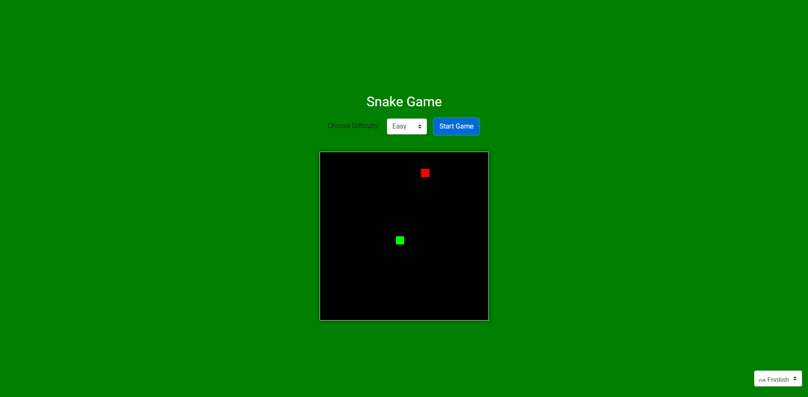

# Snake Game 🐍

## Español

### Descripción

¡Bienvenido al juego de la serpiente! Este proyecto es una versión moderna del clásico juego de la serpiente, creado utilizando HTML, CSS, JavaScript y Bootstrap. Con diferentes niveles de dificultad y la opción de cambiar el idioma, ¡te desafiará mientras intentas conseguir la puntuación más alta posible!

### Características

- 🎮 **5 Niveles de Dificultad**: Elige entre Fácil, Normal, Difícil, Experto y Demencial.
- 🌐 **Multilingüe**: Elige entre 10 idiomas diferentes.
- 🕹 **Controles Simples**: Usa las teclas de flecha para mover la serpiente.
- 🌟 **Interfaz Moderna**: Diseño atractivo y funcional.

### Instrucciones

1. Clona este repositorio en tu máquina local.
    ```sh
    git clone https://github.com/juanchu12/8bitsnake.git
    ```
2. Abre `index.html` en tu navegador favorito.
3. Selecciona el idioma y la dificultad, y luego haz clic en "Iniciar Juego".

### Controles

- ⬅️ **Izquierda**: Mover hacia la izquierda
- ⬆️ **Arriba**: Mover hacia arriba
- ➡️ **Derecha**: Mover hacia la derecha
- ⬇️ **Abajo**: Mover hacia abajo

### Capturas de Pantalla



### Créditos

Desarrollado por [Juan Hernández Castillo](https://github.com/juanchu12).

### Licencia

Este proyecto está licenciado bajo la Licencia MIT. Consulta el archivo `LICENSE` para más detalles.

---

## English

### Description

Welcome to the Snake Game! This project is a modern version of the classic Snake game, created using HTML, CSS, JavaScript, and Bootstrap. With different difficulty levels and language options, it will challenge you while you try to achieve the highest score possible!

### Features

- 🎮 **5 Difficulty Levels**: Choose between Easy, Normal, Hard, Expert, and Insane.
- 🌐 **Multilingual**: Choose from 10 different languages.
- 🕹 **Simple Controls**: Use the arrow keys to move the snake.
- 🌟 **Modern Interface**: Attractive and functional design.

### Instructions

1. Clone this repository to your local machine.
    ```sh
    git clone https://github.com/juanchu12/8bitsnake.git
    ```
2. Open `index.html` in your favorite browser.
3. Select the language and difficulty, and then click "Start Game".

### Controls

- ⬅️ **Left**: Move left
- ⬆️ **Up**: Move up
- ➡️ **Right**: Move right
- ⬇️ **Down**: Move down

### Screenshots


### Credits

Developed by [Juan Hernández Castillo](https://github.com/juanchu12).

### License

This project is licensed under the MIT License. See the `LICENSE` file for details.
